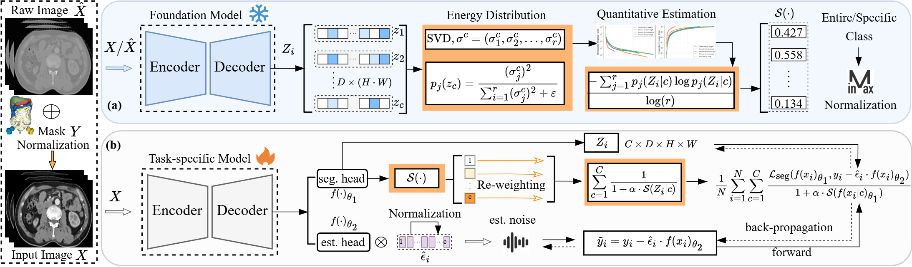

# CVPR_AUV
# Delving Aleatoric Uncertainty in Medical Image Segmentation via Vision Foundation Models (CVPR 2026)

Official PyTorch implementation of the paper: **"Delving Aleatoric Uncertainty in Medical Image Segmentation via Vision Foundation Models"**.

---

## 📖 Introduction

Medical image segmentation provides critical support for clinical workflows. However, medical image datasets are often affected by acquisition noise and annotation ambiguity, leading to pervasive data uncertainty (aleatoric uncertainty) that substantially undermines model robustness. While existing studies focus primarily on model architectural improvements and predictive reliability estimation, a systematic exploration of the intrinsic data uncertainty remains insufficient.

To address this gap, this work proposes leveraging the universal representation capabilities of visual foundation models to estimate inherent data uncertainty. Specifically, we analyze the feature diversity of the model's decoded representations and quantify their singular value energy to define the **semantic perception scale** for each class, thereby measuring sample difficulty and aleatoric uncertainty without relying on annotations. 

Based on this foundation, we design two uncertainty-driven application strategies:
1. **Aleatoric Uncertainty-Aware Data Filtering**: To eliminate potentially noisy samples and enhance model learning quality.
2. **Dynamic Uncertainty-Aware Optimization (DUO)**: An adaptive optimization strategy that dynamically adjusts class-specific loss weights during training based on the semantic perception scale, combined with a label denoising mechanism to improve training stability.

---

## 🛠️ Methodology Pipeline


*Figure: Overview of our proposed framework, illustrating the quantification of aleatoric uncertainty and its two major applications (Data Filtering and DUO).*

---

## 💻 Core Implementation
Example 1: Calculating Aleatoric Uncertainty Value (AUV) via Visual Foundation Models
This example demonstrates how to use a pre-trained Vision Foundation Model (VFM) as a fixed feature extractor to evaluate sample difficulty and derive the final dataset-level AUV.
```python
# Assume MedSAM2 is implemented in your network directory
from networks.medsam2 import MedSAM2 

# 1. Initialize a pre-trained Vision Foundation Model as a fixed feature extractor 
vfm_model = MedSAM2(checkpoint="checkpoints/medsam2_vit_b.pth").cuda()
vfm_model.eval()

# Simulate a batch of 3D medical images (e.g., shape: [Batch, Channel, Depth, Height, Width])
input_images = torch.rand((2, 1, 96, 96, 96)).cuda() 

with torch.no_grad():
    # 2. Extract stable task-agnostic representations Z from the VFM 
    vfm_features = vfm_model.forward_encoder_decoder(input_images) # Expected shape: [B, C, D, H, W]

# 3. Compute the semantic perception scale for each class [cite: 172, 447]
semantic_scales = compute_all_semantic_scales(vfm_features, svd_mode='D_HW') # [B, C]

# 4. Aggregate across foreground classes to obtain the total sample scale S(Z_i) 
sample_scales = torch.sum(semantic_scales[:, 1:], dim=1) # Shape: [B]

# 5. Derive the Aleatoric Uncertainty Value (AUV) via logarithmic min-max normalization 
# Note: In practice, min_log_S and max_log_S should be calculated globally 
# over the entire training set to perform accurate data filtering.
log_S = torch.log(sample_scales + 1e-8)
min_log_S, max_log_S = log_S.min(), log_S.max() 

auv = 1.0 - (log_S - min_log_S) / (max_log_S - min_log_S + 1e-8) # Closer to 1 means higher uncertainty
print("Calculated sample-level AUVs:", auv.cpu().numpy())
```
Example 2: Dynamic Uncertainty-Aware Optimization (DUO) During Training
This example shows how to embed the plug-and-play DUO loss function into your training loop, integrating both adaptive loss re-weighting and a label denoising mechanism.
```python
import torch.nn as nn
import torch.nn.functional as F

def dynamic_uncertainty_aware_loss(seg_logits, noise_logits, targets, alpha=0.5):
    """
    Implements the DUO adaptive loss function.
    
    Args:
        seg_logits (torch.Tensor): Logits from the main segmentation head 
        noise_logits (torch.Tensor): Logits from the independent noise estimation head 
        targets (torch.Tensor): One-hot ground truth masks, shape [B, C, D, H, W]
        alpha (float): Hyperparameter controlling the scale regularizer contribution 
    """
    B, C = seg_logits.shape[:2]
    total_loss = 0.0
    
    # 1. Dynamically compute the semantic perception scales from current predictions 
    semantic_scales = compute_all_semantic_scales(seg_logits, svd_mode='D_HW') # Shape: [B, C]
    
    # 2. Label Denoising: approximate clean targets using the noise estimation head 
    est_noise = torch.sigmoid(noise_logits) 
    denoised_targets = targets - (est_noise * targets)
    denoised_targets = denoised_targets.detach() # Stop gradients for target stabilization

    # 3. Dynamic Uncertainty Re-weighting
    for c in range(1, C): # Loop over foreground classes
        for b in range(B):
            pred_b_c = seg_logits[b, c:c+1] 
            target_b_c = denoised_targets[b, c:c+1]
            
            # Compute standard segmentation base loss (e.g., BCE Loss + Dice Loss)
            # base_loss = bce_loss(pred_b_c, target_b_c) + dice_loss(pred_b_c, target_b_c)
            base_loss = F.binary_cross_entropy_with_logits(pred_b_c, target_b_c) 
            
            # Apply dynamic regularizer scale: 1 + \alpha * S(f(x_i|c)) 
            scale_factor = 1.0 + alpha * semantic_scales[b, c]
            
            # Accumulate the adaptively weighted loss 
            total_loss += (base_loss / scale_factor)

    return total_loss / (B * (C - 1))

# --- Usage inside the training loop ---
# for images, gt_masks in train_loader:
#     seg_preds = main_segmentation_head(features)
#     noise_preds = independent_noise_head(features)
#     loss = dynamic_uncertainty_aware_loss(seg_preds, noise_preds, gt_masks, alpha=0.5)
#     optimizer.zero_grad()
#     loss.backward()
#     optimizer.step()
```
